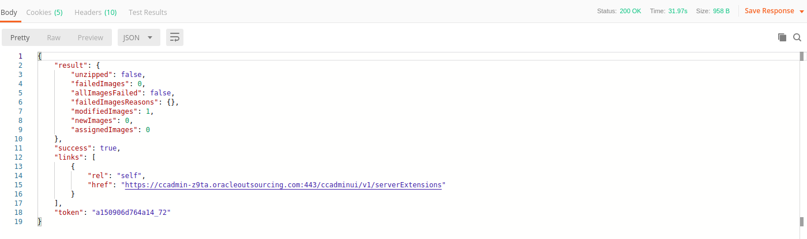

# Oracle Commerce Cloud Overview

O Oracle Commerce Cloud é uma solução de ecommerce escalável, flexível, extensível e construída para rodar no ambiente Oracle Cloud.

Documentação oficial: [Oracle Commerce Cloud](https://docs.oracle.com/cd/E93106_01/Cloud.18A/UsingCC/html/index.html).

# Deploy do custom payment gateway

Por padrão a plataforma já fornece algumas opções de configurações para gateways de pagamento nativos, mas é possível extender essa funcionalidade através das extensions para criar um gateway de pagamento customizado.

## 1 - Configurando um **gateway extension**

Para criar uma extension que implemente o custom gateway, crie os diretórios abaixo e siga as instruções de configuração de cada arquivo no link da documentação oficial:
   
```
<extension_name_folder>     # Nome do diretório da extension.
|
|-- ext.json    # Configura os metadados da extension.
|   
\-- gateway/
    |
    \-- <your_custom_gateway_ID>/   # ID do gateway (Deve ser único).
        |
        |--  gateway.json   # Configura o nome do provedor, tipos de pagamento aceitos e tipos de transação aceitas.
        |
        \-- config/
            |
            |-- config.json     # Cria a interface no painel de admin para gerenciar as configurações do gateway customizado.
            |
            \-- locales/    # Diretório onde são armazenadas as configurações do gateway em diferentes linguagens
                |
                |-- en.json     # Traduções de labelIds e de helpTexts para inglês
                |
                \-- pt.json     # Traduções da labelIds e de helpTexts para português
```

O arquivo config.json será responsável por armazenar todas as configurações do gateway e quando a request de pagamento for feita no checkout, o nó **gatewaySettings** será enviado no body contendo as informações necessárias para o custom gateway funcionar.

Para saber mais detalhes sobre a estrutura, acesse a documentação oficial: [Oracle Commerce Cloud - Custom Gateway Extension Setup](https://docs.oracle.com/cd/E93106_01/Cloud.18A/ExtendingCC/html/s2903createacreditcardextension01.html)

---
## 2 - Instalando um gateway extension

Dentro do painel admin, siga os passos abaixo:

1. Clique no ícone de menu, e em seguida em Configurações.

2. Clique em extensões e selecione a tab desenvolvedor

3. Clique no botão de gerar ID. Na caixa de diálogo, preencha o nome da extensão e clique em salvar, após esse passo um novo ID será criado.

4. Coloque o ID gerado pelo painel de admin na propriedade extensionId no arquivo ext.json

5. Na raiz do diretório da sua extension, selecione o arquivo ext.json e o diretório gateway, em seguida crie um arquivo ZIP com esses dois objetos selecionados.

6. Na tab instalado, clique no botão fazer upload de extensão e selecione o ZIP gerado no passo anterior.
---

## 3 - Habilite o custom gateway

Dentro do painel admin, siga os passos abaixo:

1. Clique no ícone de menu, e em seguida em Configurações.

2. Selecione o site para qual irá configurar o gateway.

3. Clique em processamento de pagamento e selecione a tab gateways de pagamento.

4. Selecione o gateway instalado anteriormente na listagem apresentada.  

5. Marque a caixa de seleção gateway de pagamento habilitado.

6. Preencha as configurações do gateway para os ambientes de admin, storefront e agent. Em seguida clique em salvar.
---

## 4 - Custom Properties

Custom properties são informações adicionais do pagamento que devem ser enviadas ao custom gateway quando o webhook de pagamento disparar.

Em seu widget de checkout, adicione uma função callback de validação antes do pedido ser enviado como detalhado na documentação oficial [Oracle Commerce Cloud - Order Validation](https://docs.oracle.com/cd/E89191_01/Cloud.17-4/ExtendingCC/html/s3105validatethedata01.html) para adicionar informações customizadas no pedido.

Para saber quais informações deve enviar na custom properties, verifique na documentação do seu provedor de pagamento e de antifraude (caso tenha), quais são os campos necessários.

---
## 5 - Configurando o server side extension

Dentro do painel admin, siga os passos abaixo:

1. Abra o arquivo .ZIP enviado com a documentação do gateway e importe a collection sse_deploy.json para o [Postman](https://www.getpostman.com/) instalado em sua máquina.

2. Após importar a collection, faça uma chamada para o endpoint de login do ambiente de admin da OCC para obter o token de acesso necessário para fazer o deploy.

    Observações:
    - **Autenticação em Produção**: 
      - No endpoint da requisição, altere o valor {{admin_host}} para url do host do seu admin. Ex: https://ccadmin-prod-z9ta.oracleoutsourcing.com
      - Na aba Body, altere os valores de {{admin_username}} e {{admin_password}} para suas credenciais de acesso no admin e o valor de {{admin_code}} para o código de autenticação do app **Oracle Mobile Authenticator**
    
    - **Autenticação em Stage ou Teste**: 
      - No endpoint da requisição, altere o valor {{admin_host}} para url do host do seu admin. Ex: https://ccadmin-stage-z9ta.oracleoutsourcing.com
      - Na aba Body, altere os valores de {{admin_username}} e {{admin_password}} para suas credenciais de acesso no admin

3. Com o token de acesso obtido, abra a request de deploy do server side extension e na aba headers, altere o valor {{admin_access_token}} pelo token de acesso obtido.

4. Com os headers devidamente configurados, clique na aba Body e faça upload do arquivo .ZIP do server side extension no campo fileUpload.
   
5. Faça a requisição e aguarde a resposta semelhante ao json abaixo: 
   
   
---
## 6 - Configurando o webhook

Dentro do painel admin, siga os passos abaixo:

1. Clique no ícone de menu, e em seguida em Configurações.

2. Clique em APIs da Web e selecione a tab Webhook.

3. Na seção de APIs de função, selecione o webhook de pagamento por cartão de crédito e o webhook de pagamento genérico.  

4. Cole a URL do seu gateway hospedado no server side extension. Ex: https://ccadmin-stage-braspag.oracleoutsourcing.com/ccstorex/custom/v1/payment/checkout/confirm .
   
5. Na seção de APIs de evento, selecione o webhook de envio de pedido.

6. Cole a URL do seu gateway hospedado no server side extension. Ex: https://ccadmin-stage-braspag.oracleoutsourcing.com/ccstorex/custom/v1/notification/listener/store .

7. Digite um nome de usuário e senha e para cada webhook e salve em seguida.

8. Para testar o gateway no server side extension, faça uma requisição GET para https://ccadmin-stage-braspag.oracleoutsourcing.com/ccstorex/custom/v1/teste .

Observações:
- Para cada webhook, há um de produção e um de preview, escolha com atenção em qual ambiente estará configurando seu gateway.

---


